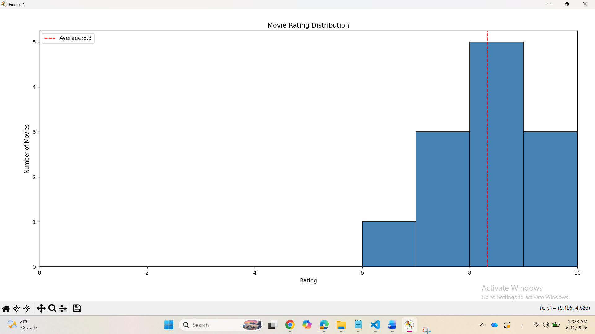
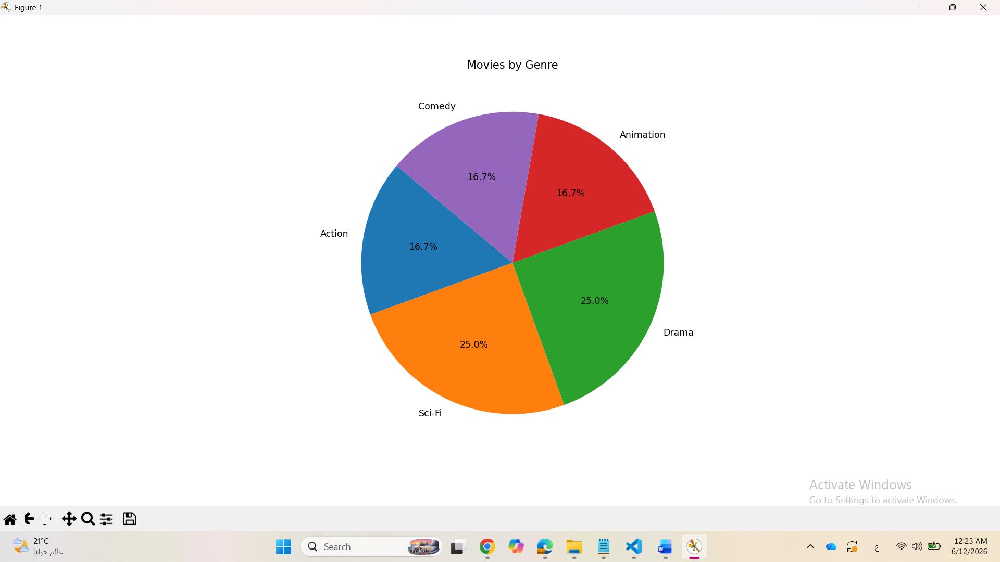
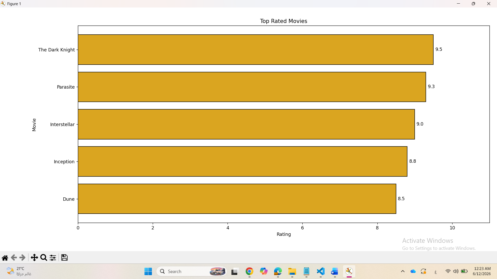
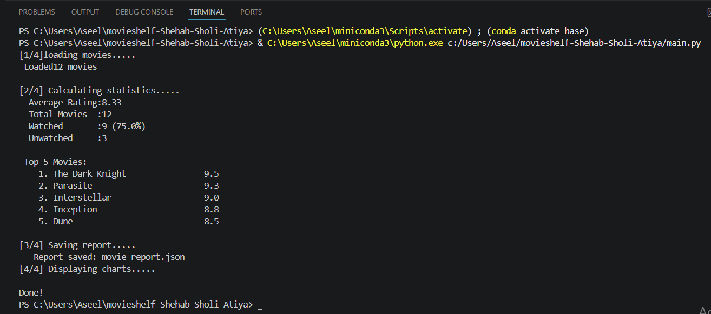

# 1:project Title & member
# MovieShelf — Personal Movie Watchlist Tracker
**Course:** Python Programming
**Members:**
- Shahed Shehab — 202211666 — Responsible for: movie_manager.py, create_sample_data.py
- Reem Sholi    — 202211538 — Responsible for: stats_analyzer.py, requirements.txt
- Aseel Atiya   — 202212011 — Responsible for: visualizer.py, main.py

**GitHub Repository:** https://github.com/shahedshehab/movieshelf-Shehab-Sholi-Atiya

# 2:project description:
MovieShelf is a Python application designed to manage a personal movie watchlist. The application loads movie data from a CSV file, analyzes the data using Python statistics, and visualizes the results through charts created with Matplotlib. It also generates a JSON report containing useful information about the movie collection. The project demonstrates the use of file handling, object-oriented programming, data analysis, and data visualization in Python.

# 3: Library used
| Library | Version | How it was used |
|---|---|---|
| matplotlib | 3.10.9 | Creating histogram, pie chart and bar chart |
| csv | Built-in |Reading and writing movie data |
| json | Built-in | Saving analysis results into JSON report |


# 4: Module Descriptions
1- movie_manager.py:
is a class have methods like loading, saving, adding and filtering movies based on watched from csv file.
most important method-->load_movies():read csv file and convert each row into dictionary with updating on data types (like year as int)

2-stats_analyzer.py:
This module contains the StatsAnalyzer class, which performs statistical analysis on movie data. It calculates average ratings, finds top-rated movies,
counts genres, and summarizes watched versus unwatched movies. The most important method is average_rating(), which computes the overall average movie rating.

3- visualizer.py:
A class that contains methods for creating charts from movie data using matplotlib, the most important method is rating_histogram(): displays a histogram of movie ratings distribution with a line showing the avg rating

4- main.py:
The file contain the main() function which serves as the entry point of the app, and it connect all the modules together by loading movies,calculating statistics, saving a JSON report, and displaying the 3 charts


# 5: Test Cases 

1. Test: load_movies() — correct number of movies and data types
**Input:**movies.csv file with 12 movies
**Expected Output:** list of 12 dicts, year as int, rating as float
**Actual Output:** 12 movies loaded correctly 
**Code snippet used to verify:**
​```python
m = MovieManager()
movies = m.load_movies("movies.csv")
print(len(movies))                  # expected: 12
print(type(movies[0]["year"]))      # expected: int
print(type(movies[0]["rating"]))    # expected: float
​```

2. Test: average_rating()
**Input:** List of 3 movies with ratings 9.5, 8.0, 7.0
**Expected Output:** 8.17
**Actual Output:** 8.17 

**Code snippet used to verify:**
​```python
sa = StatsAnalyzer()
test_movies = [
    {"title": "A", "rating": 9.5},
    {"title": "B", "rating": 8.0},
    {"title": "C", "rating": 7.0}
]
print(sa.average_rating(test_movies))   # expected: 8.17
​```

3.  Test Case: top_rated Method
- **Description:** Return top 3 highest rated movies
- **Input:**
```python
movies = [
    {"title": "Movie A", "rating": 7.5},
    {"title": "Movie B", "rating": 9.0},
    {"title": "Movie C", "rating": 8.2},
    {"title": "Movie D", "rating": 6.8}
]
n = 3
**Expected Output:** Same as expected output
**Actual Output:** 
[
    {"title": "Movie B", "rating": 9.0},
    {"title": "Movie C", "rating": 8.2},
    {"title": "Movie A", "rating": 7.5}
] ```python

4. Test: genre_counts()
- **Description:** Count number of movies per genre
- **Input:**
```python
movies = [
    {"title": "Movie A", "genre": "Action"},
    {"title": "Movie B", "genre": "Action"},
    {"title": "Movie C", "genre": "Drama"}
]
**Expected Output:** {"Action": 2, "Drama": 1}
**Actual Output:** {"Action": 2, "Drama": 1}

5. Test Case: watched_summary Method
- **Description:** Calculate watched vs unwatched summary
- **Input:**
```python
movies = [
    {"title": "Movie A", "watched": "yes"},
    {"title": "Movie B", "watched": "no"},
    {"title": "Movie C", "watched": "yes"}
]```python
**Expected Output:** {
    "total": 3,
    "watched": 2,
    "unwatched": 1,
    "watched_%": 66.7
}
```python
**Actual Output:** Same as expected output

6. Test:Full main.py run
**Input:** movies.csv with 12 movies
**Expected Output:** No errors, all 3 charts appear
**Actual Output:** all 3 charts displayed successfully
**Code snippet used to verify:**
```python
python main.py
```
# 6: Screenshots
### Rating Histogram

*Distribution of all movies ratings with average line*

### Genre Pie Chart

*Breakdown of movies by genre*

### Top Movies Bar Chart

*Top 5 highest-rated movies*

### Terminal Output

*Full output of running python main.py*


# 7: Individual Contributions
| Student | ID | Files | Commit Count | GitHub Username |
|---|---|---|---|---|
| Shahed Shehab | 202211666 | movie_manager.py, create_sample_data.py | 5 | @shahedshehab |
| Reem Sholi    | 202211538 | stats_analyzer.py, requirements.txt     | 18 | @reemsholi |
| Aseel Atiya   | 202212011 | visualizer.py, main.py                  | 9 | @aseelatiya |


# 8: Challenges & What You Learned
Shahed Shehab (202211666): the main challenge was working with dictionaries in general
solve by restudying dict  but I still feel I need more practice.

Reem Sholi (202211538):
The problem was to calculate statistics for special cases, such as movies that have an empty list. 
The solution is to first test the length of the list and then perform the calculation.

Aseel Atiya(202212011): the main challenge was configuring the correct Python interpreter in VS code to matplotlib. Solved by switching to the conda interpreter via select interpreter, I learned that the class should only contain the methods without any test code

# 9: How to Run
### Install dependencies
```bash 
pip install -r requirements.txt
```

### Create sample data
```bash
python create_sample_data.py
```

### Run the app
```bash
python main.py
```
